# Lab 01 Report - Introduction to Open Source Software

#### Personal Information

##### Bogong Yang

CS senior undergrad

Discord handle: deadbeef#6255, appears as Bogong in the OSS channel

#### Screenshot of discord:

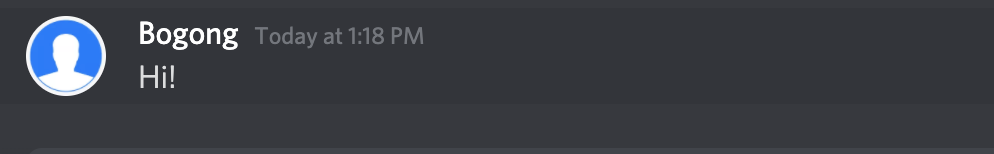

#### Reading Assignments

- More suggestions for smart questions:

  1. Provide a simple, short code snippet that replicates the problem instead of posting hundreds of lines of code
  2. When asking a question on forums such as StackOverflow, if someone thinks that the question is a duplicate, be sure to explain how the question differs from the previous ones precisely

- Chapter 3 of Free Culture

  - I do not know much about American copyright laws therefore I cannot judge who was right on the case, but I do think potential legal problems restricts creativity in some ways. I imagine if the search engine were to be open-source and properly liscensed, the student might hold against the lawsuits. However, as the passage suggests, even if the student won, the cost would still be too high for the student to pay. In this case, law was used as a tool by RIAA for making profit, as well as a restriction posed on the student researcher. I feel like unless there is some modifications in the "procedural justice" law system, such threats will still be lingering around. On the other hand, if the music were to be "open-source" in some way, RIAA might not even existed from the beginning, but the commercial nature of the market could not be simply ignored.

#### Linux

- Screenshot of `man tree`
  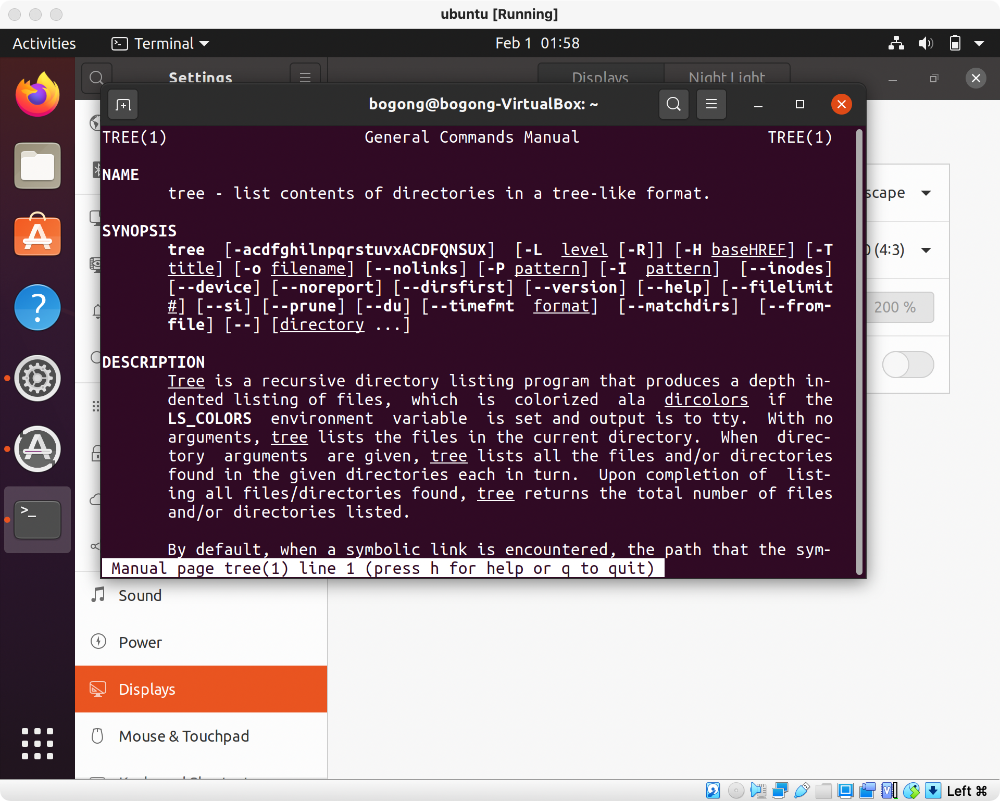

#### Regex

Practice Problems:

1. Q1:
   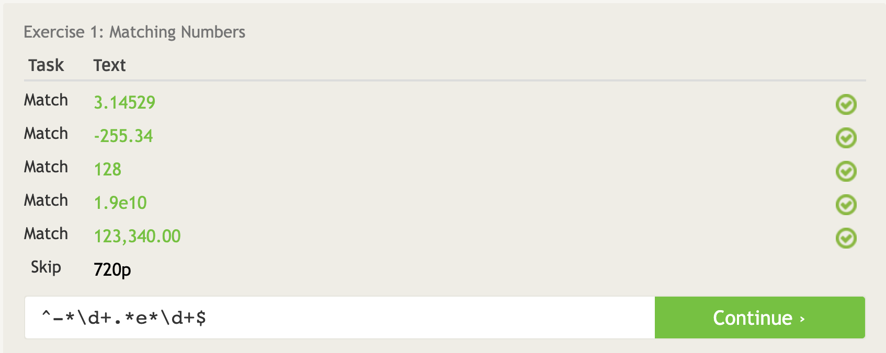
2. Q2:
   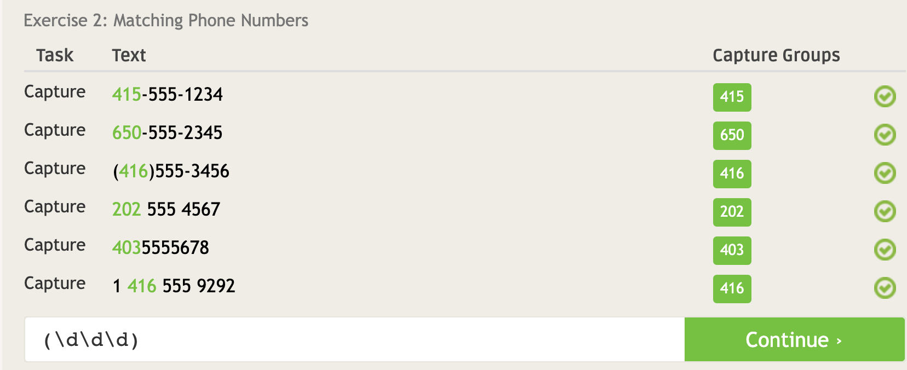
3. Q3:
   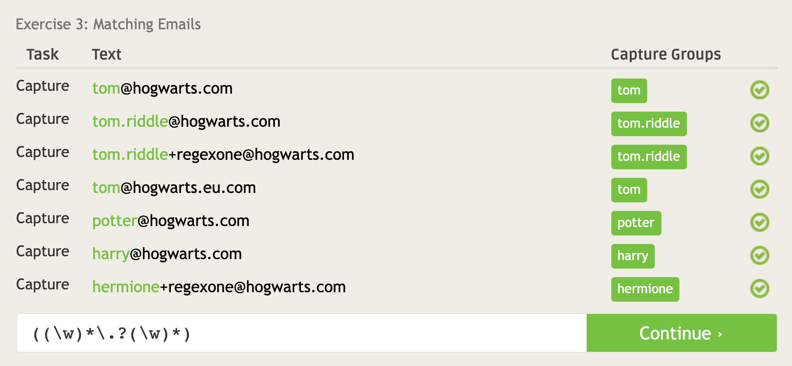
4. Q4:
   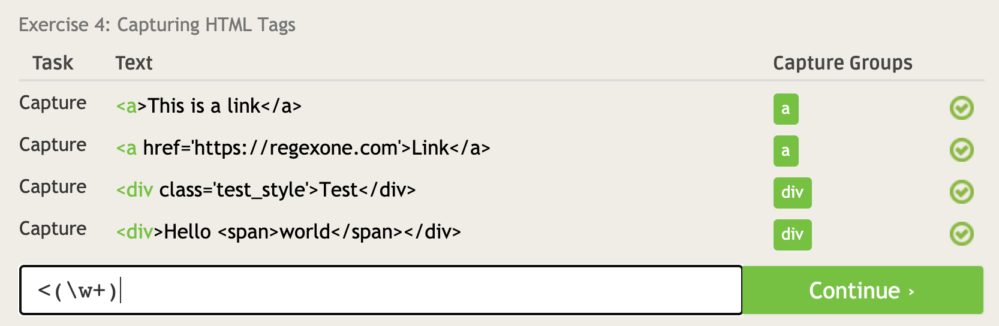
5. Q5:
   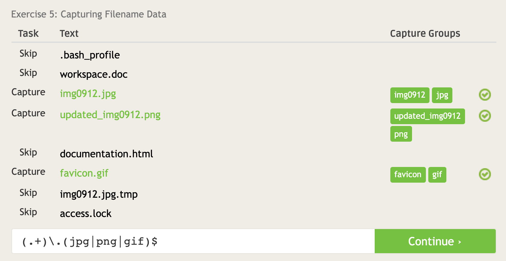
6. Q6:
   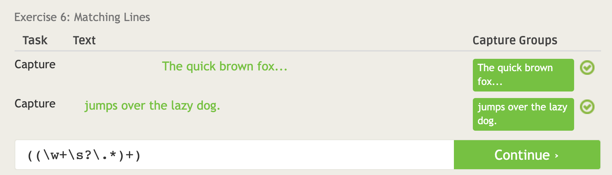
7. Q7:
   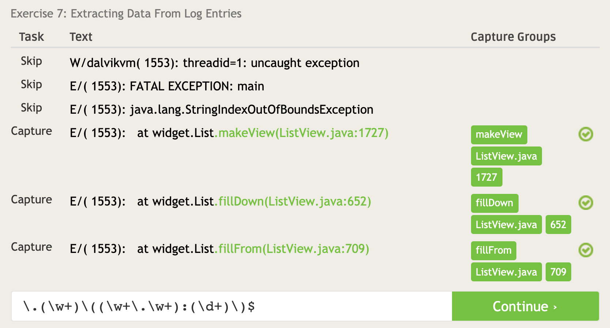

Crosswords:

1. Q1:

   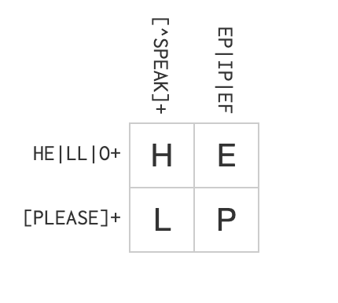

2. Q2:

   

3. Q3:

   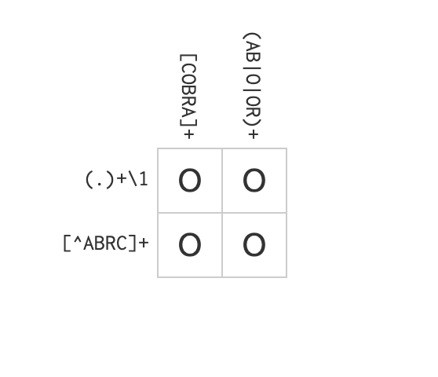

4. Q4:

   

#### Blockly

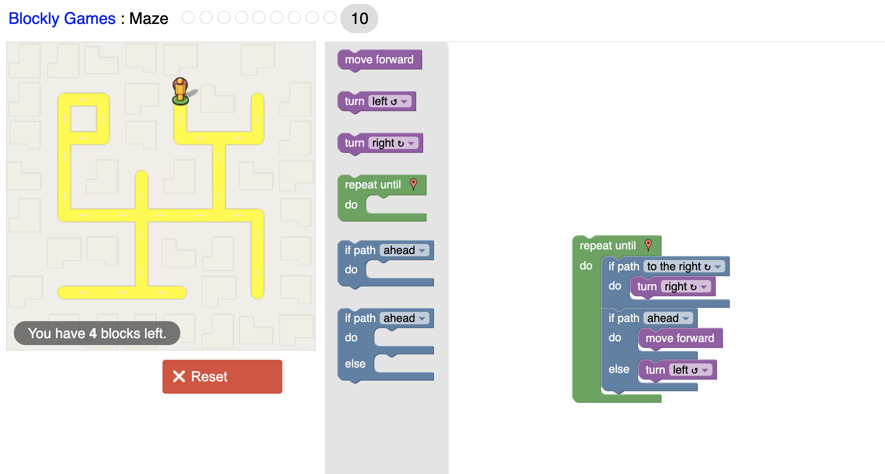

#### Reflection:

I am thinking of one of my own projects, and it was meant to be an online platform where faculties can post URP positions and students can apply to them on the platform. The problem at hand is that professors and faculties are always busy, and the emails sent by students may simply sink into the tons of emails in the inbox and remain unread. Also, from my most recent experiences, I am considering to build a platform such that students could request professors for writing recommendation letters (with notification features).
