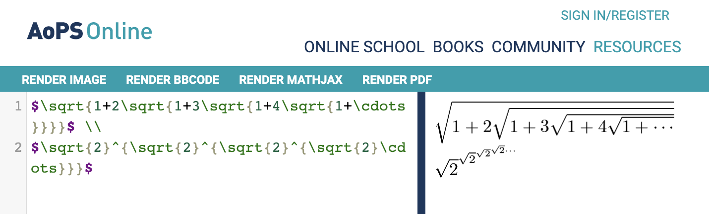
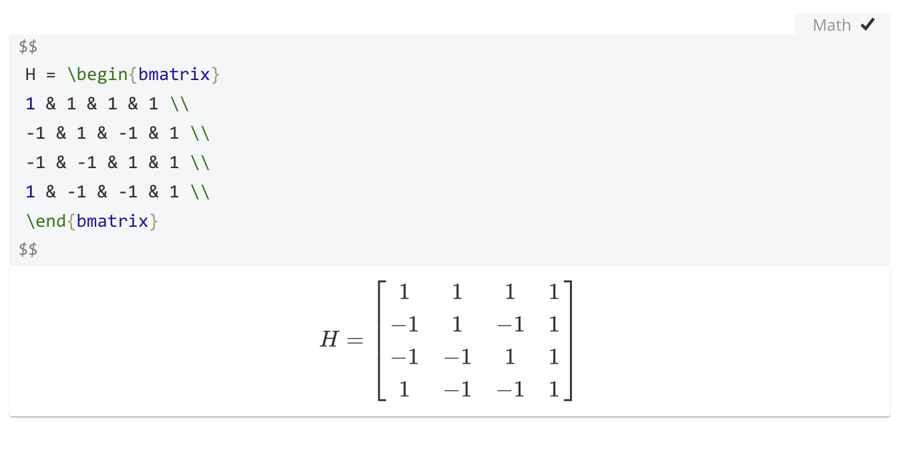
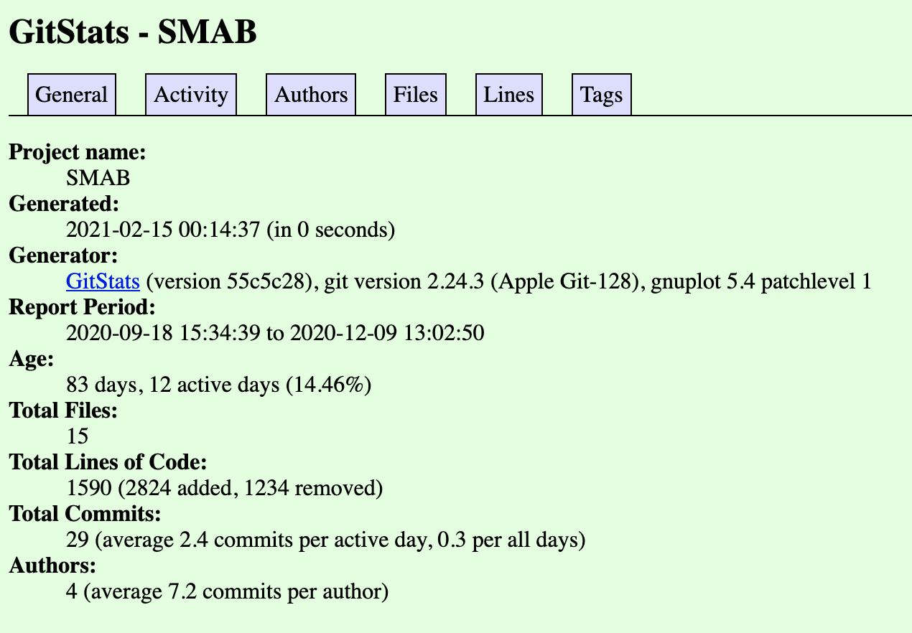
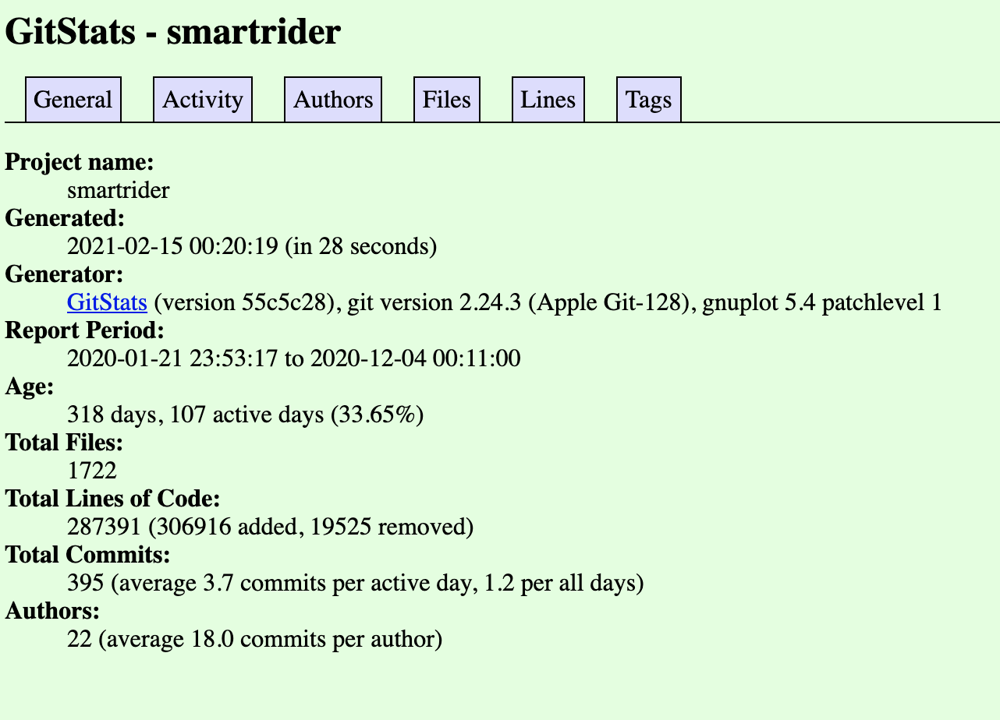

## Part 1: Documentation

[Link to the wiki page](https://github.com/Tyromancer/oss-repo-template/wiki)

## Part 2: Community

- [SMAB](https://github.com/seanmiller969/smab)

  - Number of contributors: 3
  - Lines of code: 1606
  - First commit: d6eb67161dade78a5237a4b6cf7a109fedb74387
  - Latest commit: f099ec61dc7a58080079a32e48e05a8d96bae991
  - Branches:
    - master
    - Class-Files
    - URLtraverseandJSON
    - User-Interface
    - rmupdate

- [smartrider](https://rcos.io/projects/sirmammingtonham/smartrider/profile)
  - Number of contributors: 13
  - Lines of code: 301774
  - First commit: 8ed5ddec0cbf3762876a175d85bdd2df9d10e38a
  - Latest commit: 52fb1802d5c71b522eabee04bc37f5c31bda8014
  - Branches:
    - master
    - bigger-dev
    - documentation
    - feature-onboarding
    - profile-page
    - axios-0.21.1
    - date-and-time-0.14.2
    - ini-1.3.8

Gitstats for SMAB:

- 

Gitsstats for Smartrider:

- 

It seems that the results of lines of code from `git ls-files -z | xargs -0 wc -l` and `gitstats` do not match.
I would guess that some files are skipped by gitstats but are parsed by the command line version.

Gource result for SMAB:

- 

Gource result for Smartrider:

- 
