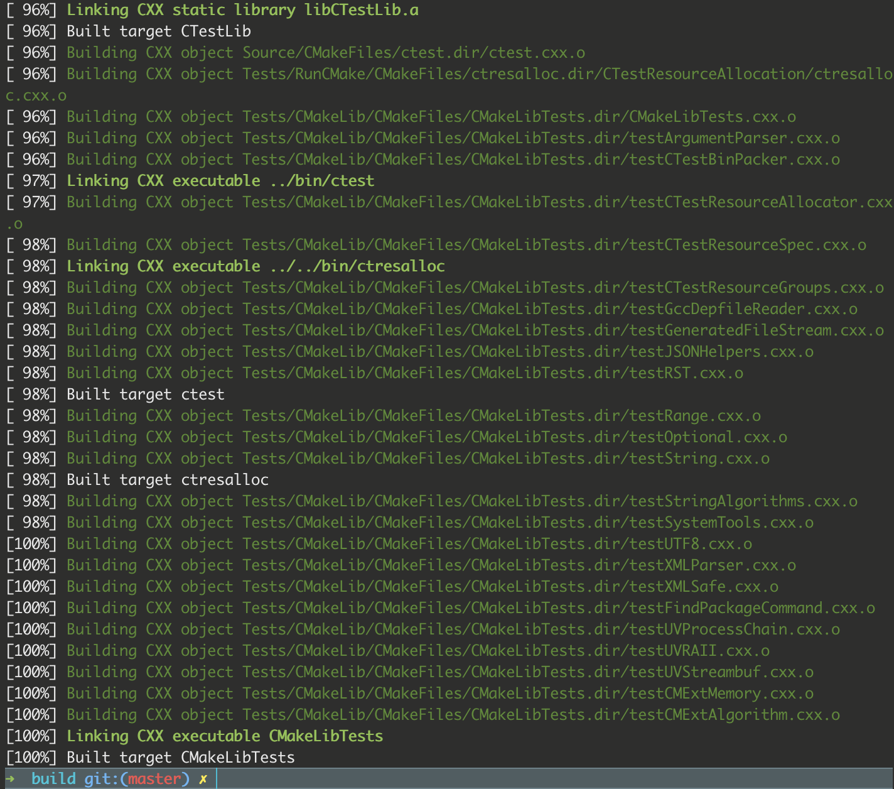
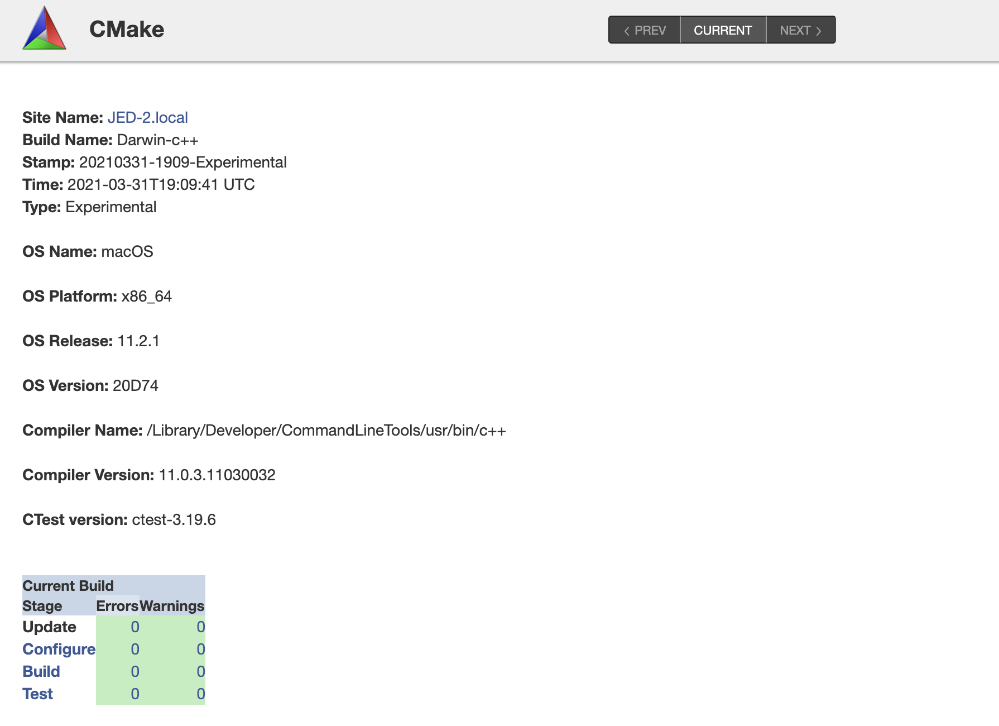
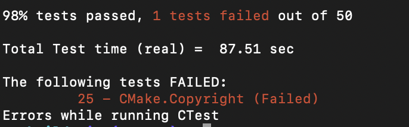
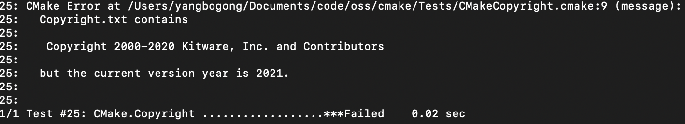
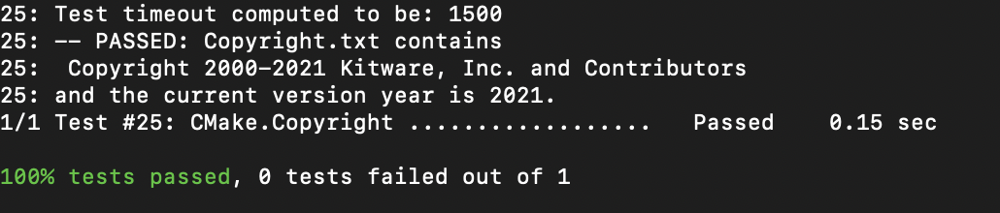
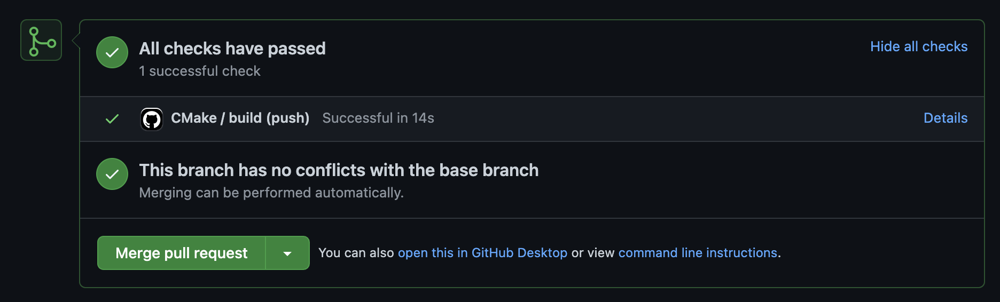

Screenshot for build complete:

Screenshot for experimental build test on cdash:

Screenshot for error message after replacing the copyright file:

Fixing the error:
From the test output we know that the test case `25 - CMake.Copyright` failed. So I ran `ctest -I 25,25 -VV` to examine the test case in verbose mode. The output is:

Therefore I changed the year to be 2000-2021, and it worked:

CI on Github:
repo: https://github.com/Tyromancer/cmake-tutorial-CI
screenshot of success check:

