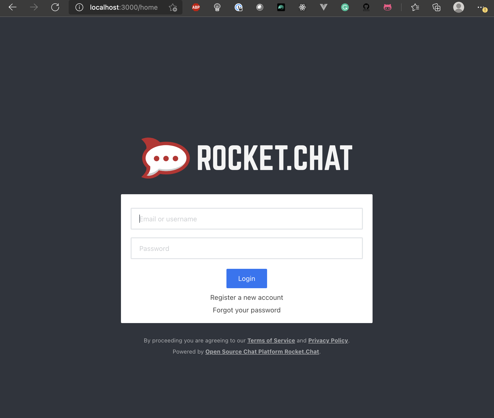
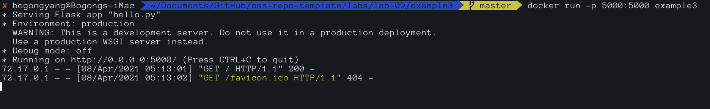

### Example 00:

### Example 01:
Pull and run ubuntu image:

Install and editing file with vim:

Install cowsay:

### Example 02:
Rocket chat on localhost:

### Example 03:
Flask served page in web browser:

Docker running the image in command line:

### Example 04:

Interacting with message app using curl:

