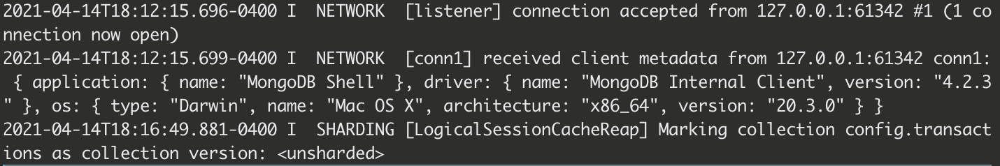
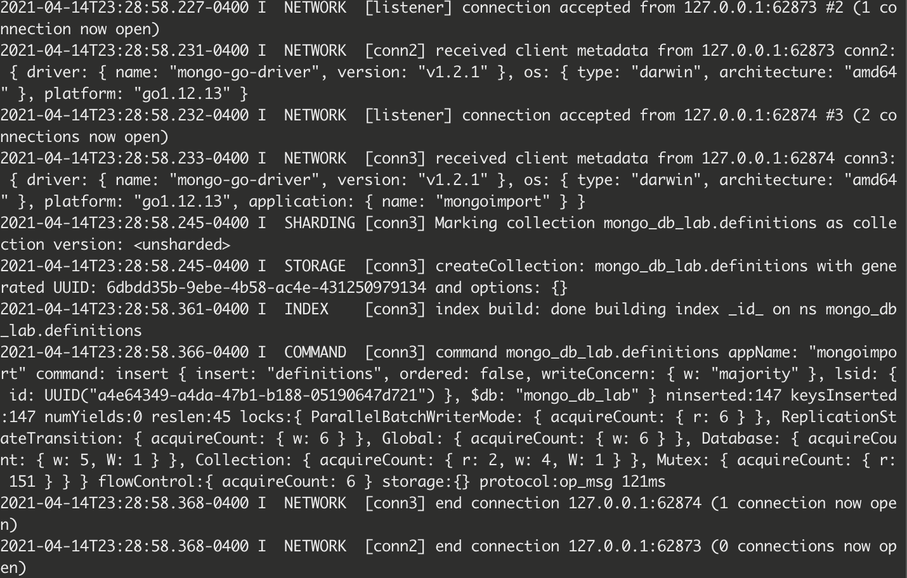
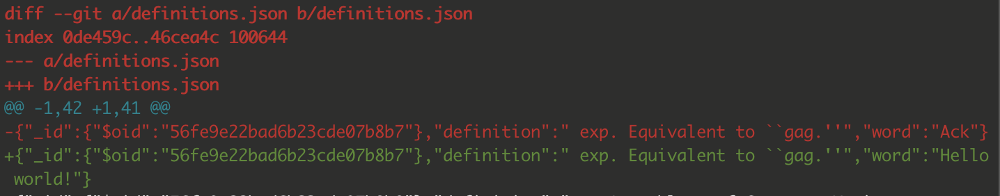

### Checkpoint 1:

Screenshot of `mongod` when connected to the server:

### Checkpoint 2:

Screenshot of `mongod` for creating collection:

### Checkpoint 3:

Screenshot of `mongo` for updating a document:

Screenshot of `git diff` after update and export:

### Checkpoint 4:

output: [text file](4.txt)

script: [checkpoint4.py](checkpoint4.py)

### Checkpoint 5:

screenshot of output:

script: [checkpoint5.py](checkpoint5.py)
