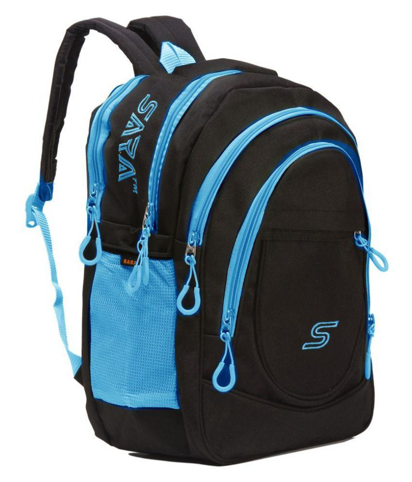

### Checkpoint 1:
Screenshot of the plotted line:

### Checkpoint 2:
Screenshot of the 15 images:

### Checkpoint 3:
Original images:

Bag:

Coat:

Shirt:

Grayscale image and predictions made by the model:

